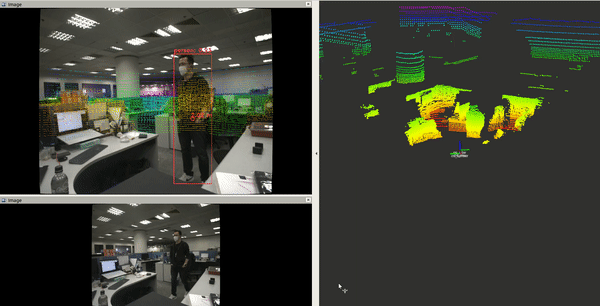
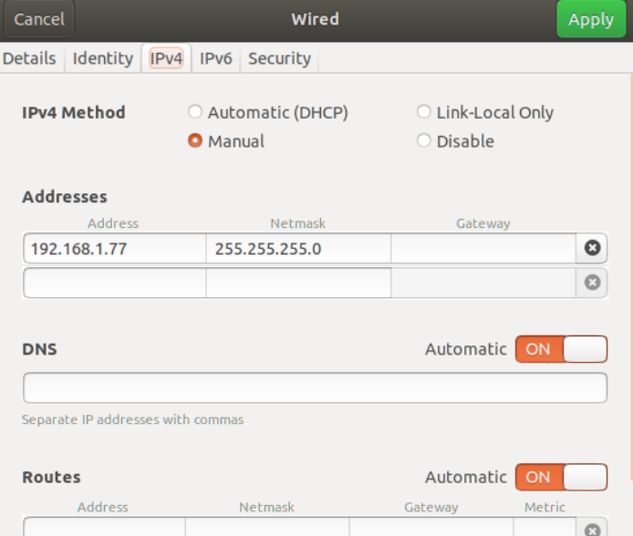
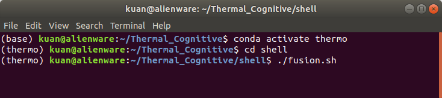

# Lidar_Projection


<b>OS</b>: Ubuntu 18.04 LTS  

## Goals
Project lidar points to rgb images

## Environment

* <b> [ROS Melodic](http://wiki.ros.org/melodic/Installation/Ubuntu)</b>
* <b>Miniconda  </b>  (optional)  
In this project,  environment <b>`Thermo'</b> is created

* <b>xterm  </b>
> sudo apt-get install xterm

* <b>Libraries  </b>  
This project requires following packages: Ouster Lidar, HIKRobot Camera.  
Make sure all packages are correctly configured. Detailed hardwardsetting are list [below](#1).

<h2 id="1"> Prerequisites </h2>

* [CUDA CuDNN](https://github.com/Kuan-HC/Install-CUDA-and-CuDNN-on-Ubuntu-18.04-LTS)
* [HIKRobot RGB Camera](./hardware_setting/hikrobot_rgb.md)
* [Run CV_Bridge in Python3](https://blog.csdn.net/qq_33445388/article/details/116034290)(for ROS Melodic)


## Installation
1. clone this project to home folder and init submodule
> cd ~/Lidar_Projection  
git submodule init  
git submodule update  
cd src/ouster-ros  
git submodule init  
git submodule update

2. Install YoloV5
> conda activate thermo  
cd ~/Thermal_Cognitive/src/yolov5/  
git checkout v6.2  
pip install -r requirements.txt  

3. 2. Install [Ouster Lidar](./hardware_setting/ouster_lidar_config.md) dependencies 
```
sudo apt install -y                     \
    ros-$ROS_DISTRO-pcl-ros             \
    ros-$ROS_DISTRO-rviz                \
    ros-$ROS_DISTRO-tf2-geometry-msgs

```
where $ROS-DISTRO is either melodic or noetic.

Additional dependenices:
```
sudo apt install -y \
    build-essential \
    libeigen3-dev   \
    libjsoncpp-dev  \
    libspdlog-dev   \
    cmake
```

4. Build project

> cd ~/Lidar_Projection  
catkin_make --cmake-args -DCMAKE_BUILD_TYPE=Release  

5. Set IP
Set your computer IP to 192.168.xx.xx




6. Launch
> conda activate thermo  
cd ~/Lidar_Projection/shell  
./fusion.sh 




<h2 id="1"> Settings </h1> 

* [HIKRobot RGB Camera](./hardware_setting/hikrobot_rgb.md)
* [YOLOV5](https://github.com/ultralytics/yolov5)
* [Ouster Lidar](./hardware_setting/ouster_lidar_config.md)
* [CUDA CUDnn](https://github.com/Kuan-HC/Install-CUDA-and-CuDNN-on-Ubuntu-18.04-LTS)

In this project, camera intrinsic calibration jupyter notebook can be found
`./calibration/CameraIntrinsic/Camera intrinsic Matrix.ipynp`

Camera Lidar calibration please refer to [link](https://github.com/Livox-SDK/livox_camera_lidar_calibration)

