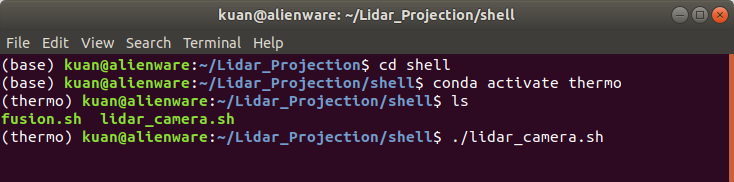
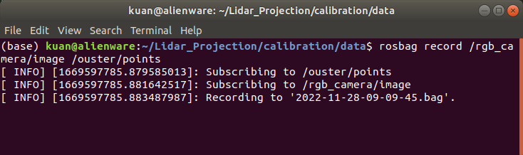
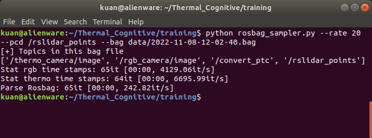
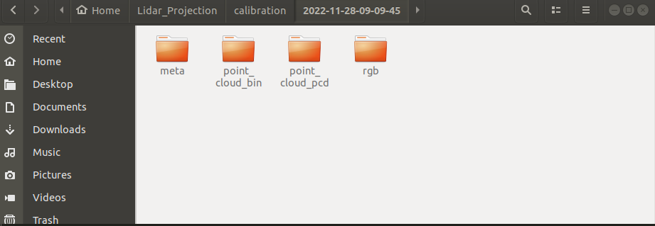
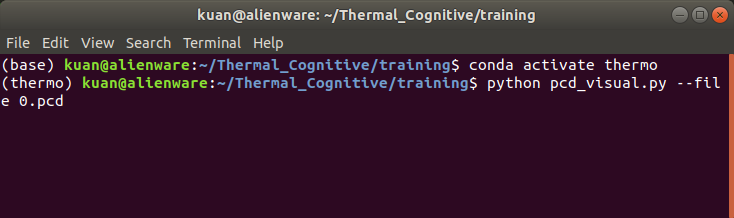
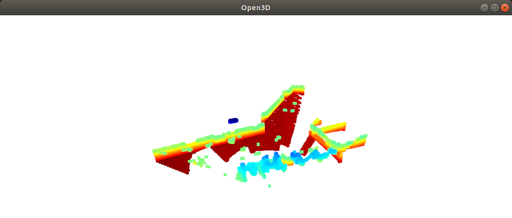

# Record ros topics and data preprocessing
<b>OS</b>: Ubuntu 18.04 LTS  

The first step to calibrate camera and lidar is to collect data. We use rosbag to record camera, and lidar.

Calibration methods please refer to [Livox tutorial](https://github.com/Kuan-HC/camera_lidar_calibration)

1. Connect RGB camera, and lidar.
2. Open Lidar_Projection/shell with a terminal.
3. Activate conda enviorment and run command:
> conda activate thermo  
./lidar_camera.sh 



4. Record topics: <b>/rgb_camera/image</b> ,and  <b>/ouster/points</b> by:  
```
rosbag record /rgb_camera/image /ouster/points
```
in this example, the rosbag file was saved in Lidar_Projection/training/data.




&emsp;&emsp;Once the bag file is created, it can be replay by command:  
&emsp;&emsp;`rosbag play --pause -l file_name.bag`  
&emsp;&emsp;`--pause` indicates the files will start with pause.  
&emsp;&emsp;`-l` indicates the files will play in loop.

5. Data preprocessing:  
   `rosbag_sampler.py`  
   <b>Node:</b> Because of cv_bridge, it makes easier to this python script in python2, if any library is needed to be installed, make sure to use <b>`pip2 install`</b> instead of <b>`pip install`</b> e.g. <b>`pip2 install tqdm`</b>.  

   This python scripts select, '/rgb_camera/image' and '/ouster/points' from the rosbag file, sampling rate can be set as per X frames.  

   <b>Note:</b>  
   `rosbag_sampler.py` takes three arguments:   
   &emsp;&emsp;`--rate`: default value 10 - 1 sample to take per X frames)  
   &emsp;&emsp;`--pcd`: default value `'/ouster/points'`  
   &emsp;&emsp;`--output_dir`: default payh: python script folder  
   &emsp;&emsp;`--bag`: rosbag to read and sample.  
   In this example, use the python2 installed along with ros melodic, deactivate conda environment.  
   
   ```
   conda deactivate           
   python rosbag_sampler.py --rate 20 --bag data/xxx.bag
   ```
   

6. Result:  
   A folder with the input bag file name shall be created. It includes three sub-folders <b>meta</b>, <b>point_cloud_bin</b>, <b>point_cloud_pcd</b>, <b>rgb</b>,and <b>thermo</b>
   

7. Visualization:   
   In this example, a pcd file is visualized by open3d  
   <b>open3d install</b>  
   > pip install open3d  

   <b>visualization pcd</b> 
   > python pcd_visual.py --file {file_path}

   

   


   


