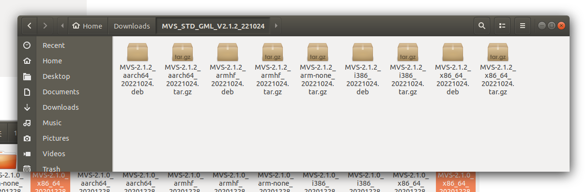

# HIKRobot RGB Camera Configuration
<b>OS</b>: Ubuntu 18.04 LTS  
<b>Camera</b> HIKROBOT  MV-CH050-10UC

1. [Install Camera Driver](#1)  
2. [Create FLIR ROS Node](#2)  
3. [Visualize Lidar and Camera Data](#3)


<h2 id="1"> Install Camera Driver </h2>
1. Install MVS SDK

1.1 Download the Machine Vision Software MVS2.1.2 for Linux `MVS_STD_GML_V2.1.2_221024.zip` and extracte it
[Link](https://www.hikrobotics.com/en/machinevision/service/download?module=0)

1.2 Fint package for your plateform and extract it, in this case, we use an <b>intel x86_64 </b> system  


1.3  Install HIKRobot Driver  
Open a terminal in the folder we just extracted in the last step and run
> sudo setup.sh  


 
Finished.


Install Dependency
> sudo apt-get install libx11-dev

1.4 Test  
Connect camera via USB.  
Open folde: `/opt/MVS/bin`
Double clik icon MVS


Connect USB devices and then `Start Acquistion`


1.5  Adjust Image Formate
Set Width and Height, the value must be a multiple of 32   
  

Set pixel format to BGR 8  


Save  


1.6 Run scripts
Open a terminal and run
```
roscore  
```
Open one more terminal and run
```
cd ~/Thermal_Cognitive/src/rgb_camera/src
# In thermo_image_detect.py, set device name in line 167 to HIK_THERMO
# replace line 168 with device.show_raw_image()
python thermo_image_detect.py
```


