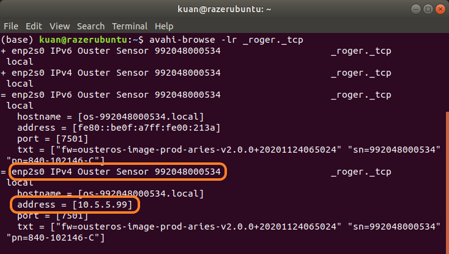
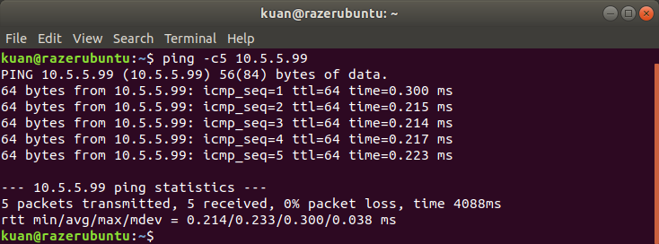
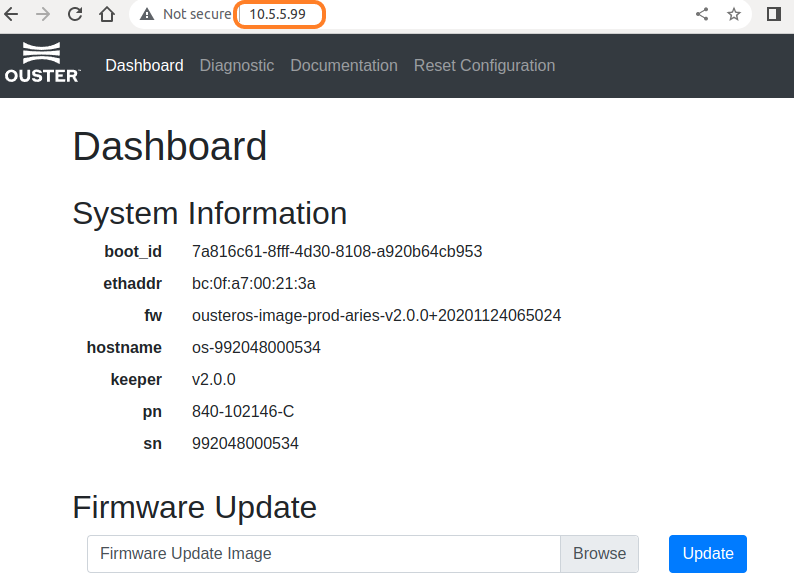

# Lidar Configuration
<b>OS</b>: Ubuntu 18.04 LTS  
<b> Lidar</b>: Ouster OS2 Lidar


1. [Configure Ouster lider IP](#1)  
2. [Install Ouster ROS package](#2) 
3. [Launch Ourster ROS and Visuazlize Point-Cloud Data](#3) 


<h2 id="1"> Configure Ouster lider IP </h2>

<br>1. Connect the Lidar with Computer as show in the figure above.</br>
<br>2. Manual set the local IPV4 address to `10.5.5.1` and Netmask to `255.255.255.0`. Turn off the connect and than on to activate the setting</br>.

 


<br>3. Check local IPV4 and device name</br>
> ip addr  


```
device name: enp2s0
device ip = 10.5.5.1
```
<br>4. Search lidar IP</br>

> avahi-browse -lr _roger._tcp


`Ethernet device: enp2s0 connects to Ouster sensor. Lidar address 169.254.39.51`

If IPv4 not shown, please turn off weired connect, and try again.  
With lidar IP, we can check lidar information via web browser.


<br>5. Set lidar IP</br>

Computer and Lidar are not in the same network segment, therefore, change lidar IP.
> sudo dnsmasq -C /dev/null -kd -F 10.5.5.50,10.5.5.100 -i 
<b>device-name</b> --bind-dynamic

This could take couple minutes.


Lidar IP is set to 10.5.5.99

check lidar IP
> avahi-browse -lr _roger._tcp



<br>6. Check Lidar connection</br>

ping lidar or via web-browser
> ping -c5 <b>lidar-ip</b>  


<br></br>


<br><h2 id="2"> Install Ouster ROS package </h2></br>
<br>1. create ros workspace </br>
> mkdir -p Lidar_Project/src

<br>2. add `ouster_example` to `catkin_ws/src` folder </br>
<b>Tag</b>: 20220608
> cd ~/Lidar_Project/src  
git clone --depth 1 --branch 20220608 https://github.com/ouster-lidar/ouster_example.git

<br>3. build package </br>
> cd ~/Lidar_Project
catkin_make  

<h2 id="3"> Launch Ourster ROS and Visuazlize Point-Cloud Data </h2>
<br>1. source workspace </br>

> cd ~/Lidar_Project  
source devel/setup.bash  


We can add command to ~/.bashrc, so we don't neet to source every time.
> gedit ~/.bashrc  

add `source ~/Lidar_Project/devel/setup.bash` to the bottom.

<br>2. Launch ouster launch file </br>
open a terminal in folder ouster_ros

> roslaunch ouster_ros ouster.launch sensor_hostname:=<LiDAR_IP_Address> udp_dest:=
<PC_IP_Address> viz:=true image:=true metadata:=<Json_File_Path>

We set sensor ip to 10.5.5.99 and pc ip to 10.5.5.1 in the previous chapter. In our case, to launch ouster launch file, the command would be like below. 

`In this version, it now requires the user to specify a path for metadata output instead of defaulting to $ROS_HOME`

> roslaunch ouster.launch sensor_hostname:=10.5.5.99 udp_dest:=10.5.5.1 viz:=true image:=true metadata:=meta.json


Here the arguments are:
* `sensor_hostname`:= hostname or IP in dotted decimal form of the LiDAR
* `udp_dest`:= hostname or IP where the sensor will send data packets, which is the PC IP
address
* `viz`:= whether to run rviz
* `image`:= whether publish range/intensity/ambient image topic
* `lidar_mode`:= LiDAR's resolution and rate: either 512x10, 512x20, 1024x10, 1024x20, or
2048x10, default is 1024x10

If launch successfully, then both depth image and point cloud can be visualized via Rviz.


## Note:
When ouster sensor was launch, it is required to specify lidar and pc IP address. It is not necessary to change lidar ip to 10.5.5. XX., but it it necessary to manual change PC IPv4 to 10.5.5.1.
