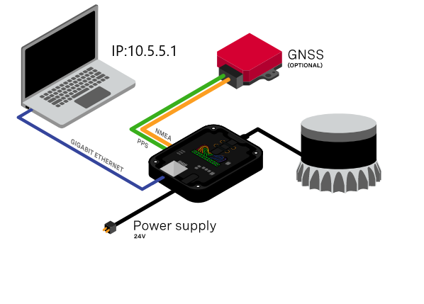
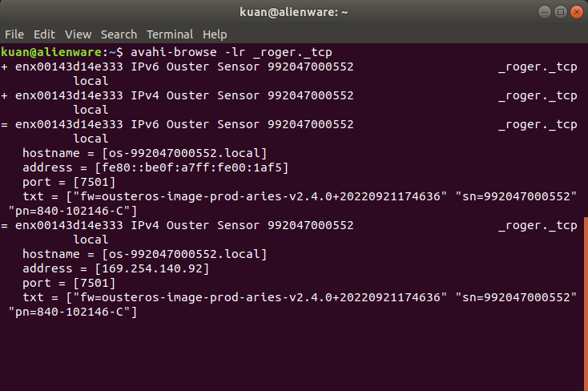
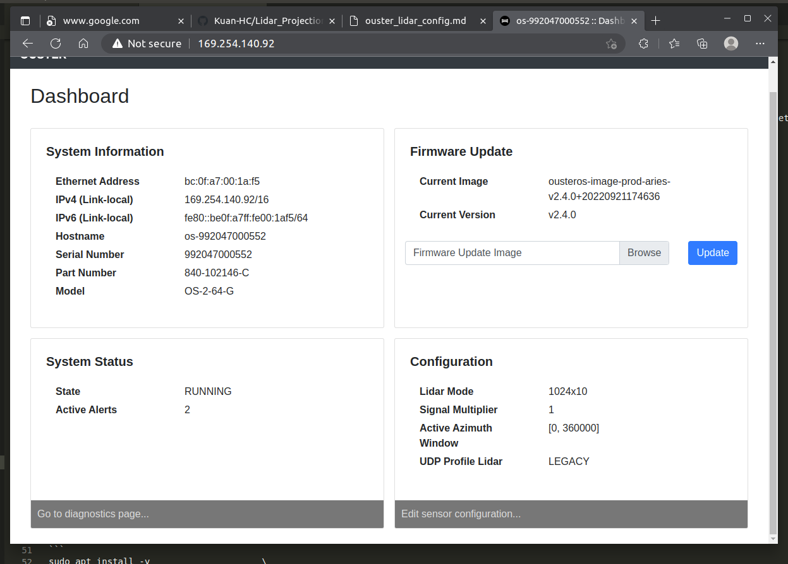

# Lidar Configuration
<b>OS</b>: Ubuntu 18.04 LTS  
<b> Lidar</b>: Ouster OS2 Lidar



1. [Configure Ouster lider IP](#1)  
2. [Install Ouster ROS package](#2) 
3. [Launch Ourster ROS and Visuazlize Point-Cloud Data](#3) 


<h2 id="1"> Configure Ouster lider IP </h2>

<br>1. Connect the Lidar with Computer as show in the figure above.</br>
<br>2. Manual set the local IPV4 address to `10.5.5.1` and Netmask to `255.255.255.0`. Turn off the connect and than on to activate the setting</br>.

 


<br>3. Check local IPV4 and device name</br>
> ip addr  


```
device name: enp2s0
device ip = 10.5.5.1
```
<br>4. Search lidar IP</br>

> avahi-browse -lr _roger._tcp



`Ethernet device: enx00143d14e333 connects to Ouster sensor. Lidar address 169.254.140.92`

If IPv4 not shown, please turn off weired connect, and try again.  
With lidar IP, we can check lidar information via web browser.



<br>5. Lidar connection</br>
Run this command to check lidar connection
> ping -c5 169.254.140.92  


<br>1. create ros workspace </br>
> mkdir -p Lidar_Project/src

<br>2. add `ouster_example` to `catkin_ws/src` folder </br>

> cd ~/Lidar_Project/src  
git clone --recurse-submodules https://github.com/ouster-lidar/ouster-ros.git

<br>3. requierments and dependencies </br>
```
sudo apt install -y                     \
    ros-$ROS_DISTRO-pcl-ros             \
    ros-$ROS_DISTRO-rviz                \
    ros-$ROS_DISTRO-tf2-geometry-msgs
```
where `$ROS-DISTRO` is either `melodic` or `noetic`.

Additional dependenices:
```
sudo apt install -y \
    build-essential \
    libeigen3-dev   \
    libjsoncpp-dev  \
    libspdlog-dev   \
    cmake
```
<br>4. build package </br>
 source the ROS environemt
 > source /opt/ros/melodic/setup.bash   

catkin_make command from within the catkin workspace

> cd ~/Lidar_Project  
catkin_make --cmake-args -DCMAKE_BUILD_TYPE=Release  

<h2 id="3"> Launch Ourster ROS and Visuazlize Point-Cloud Data </h2>
<br>1. source workspace </br>

> cd ~/Lidar_Project  
source devel/setup.bash  


We can add command to ~/.bashrc, so we don't neet to source every time.
> gedit ~/.bashrc  

add `source ~/Lidar_Project/devel/setup.bash` to the bottom.

<br>2. Launch ouster launch file </br>
open a terminal in folder ouster_ros

> roslaunch ouster_ros sensor.launch sensor_hostname:=<sensor ost name>  

We set sensor ip to 10.5.5.99 and pc ip to 10.5.5.1 in the previous chapter. In our case, to launch ouster launch file, the command would be like below. 

`In this version, it now requires the user to specify a path for metadata output instead of defaulting to $ROS_HOME`

> roslaunch ouster_ros sensor.launch sensor_hostname:=169.254.39.51  viz:=true 


Here the arguments are:
* `sensor_hostname`:= hostname or IP in dotted decimal form of the LiDAR
* `viz`:= whether to run rviz


If launch successfully, then both depth image and point cloud can be visualized via Rviz.


